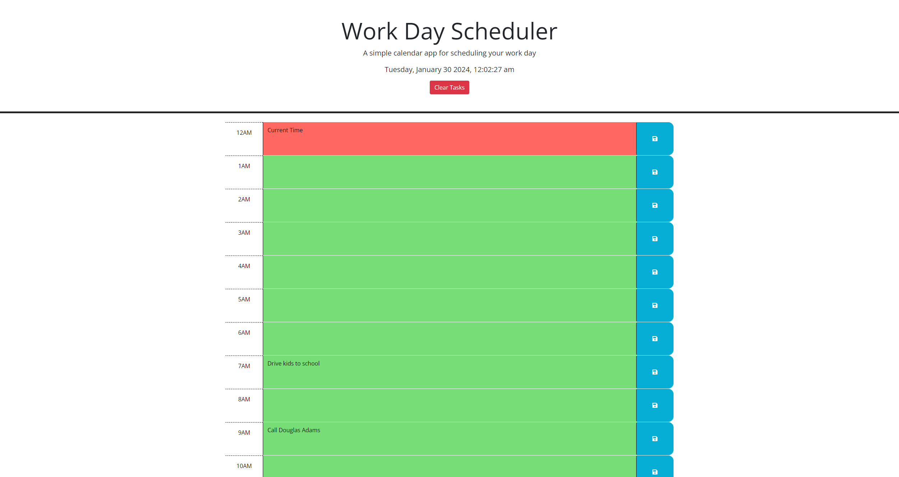

# Work Day Scheduler

## Description
Set up a simple calendar for your workday!
  
## Table of Contents
- [Installation](#installation)
- [Usage](#usage)
- [Tests](#tests)
- [Contributors](#contributing)
- [Questions](#questions)
- [License](#license)

## Preview

  
## Installation
1. Click the link!
https://hunterbell512.github.io/workday-scheduler
  
## Usage
- This app makes organizing your workday a breeze.

## Tests
Here are some tests to run to verify a proper install:
```bash
N/A
```

## Contributors
- Hunter Bell

## Questions
If you have any questions, please reach out!
- Github: [HunterBell512](https://github.com/HunterBell512)
- Email: [bellhunter512@gmail.com](mailto:bellhunter512@gmail.com)

## License
N/A
